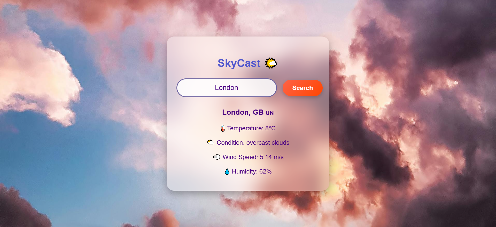

# 🌤️ SkyCast - Your Weather Companion  
SkyCast is a dynamic weather forecasting app that provides real-time weather updates using [Weather API Name]. Stay informed about temperature, humidity, and weather conditions anywhere in the world!  

##  Features  
 Real-time weather updates 🌍  
 Search by city or location 🔍  
 Displays temperature, humidity, and wind speed 🌡️  

##  Screenshots  
 
 
 


## 🛠️ Getting Started  

Follow these steps to set up the project locally:

### 1. Clone the Repository  
```bash
git clone https://github.com/your-username/SkyCast.git
cd SkyCast
```
### 2. Install Dependencies  
```bash
npm install
```
### 3.Set up API Key
```bash
REACT_APP_API_KEY=your_api_key_here
```
### 4.Start the server
```bash
npm start  frontend
node server.js backend
```
##  Technologies Used  
- React  
- JavaScript (ES6+)  
- CSS  
- [OPEN WEATHER API KEY]

## 📄 License  
This project is licensed under the [MIT License](LICENSE).


